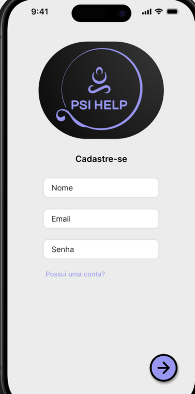
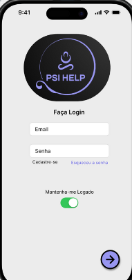

# Atendimento de Psicóloga

    
    
Este é um projeto de extensão da faculdade desenvolvido em JavaScript. O objetivo do sistema é fornecer uma ferramenta para facilitar o atendimento da psicóloga, ajudando-a a organizar e facilitar a marcação de consulta e pagamento, entre outras facilidades.

    <h3>📊 Sistema de Atendimento da Psicóloga 🚨 Em Desenvolvimento... 📊</h3>
    <h4>Pré-requisitos</h4>
    
Para iniciar o projeto, você precisará ter algumas ferramentas instaladas em sua máquina:

    <ul>
        <li>Node</li>
        <li>Visual Studio Code</li>
        <li>MongoDB Workbench para gerenciar o banco de dados MongoDB</li>
    </ul>
    <h4>Configurando o ambiente de desenvolvimento</h4>
    <ul>
        <li>Instale o Node e configure as variáveis de ambiente.</li>
        <li>Instale o VSCODE para desenvolvimento do projeto.</li>
        <li>Instale o MongoDB e configure a conexão com o banco de dados para gerenciar as informações.</li>
    </ul>
    

        
        
        
    

